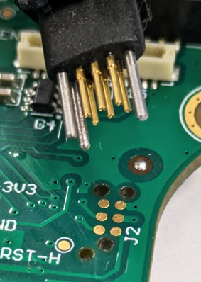
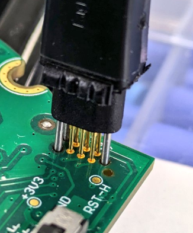

# Potentiostat Firmware

Welcome to the potentiostat firmware repository, this software is recommanded to be used with: 
- Potentiostat python package driver [**pyBEEP**](https://github.com/aurelienblanc2/Potentiostat-driver-pyBEEP)
- Potentiostat python package datapipeline [**potentiopipe**](https://github.com/aurelienblanc2/Potentiostat-datapipeline)

If you wish to share all three repos at once, here is the [**link**](https://github.com/stars/aurelienblanc2/lists/potentiostat)

---

## Overview

This Potentiostat Firmware provides:
- Voltage Control
- Current Measurement
- Wavefront Generation (CV, CA, CP, ...)
- Digital filtering 
- Parametrization

---

## Main Functionalities

---

## Compiling

You can compile the project directly using the terminal of your operating system (described below), or use 
[STM32CubeIDE](https://www.st.com/en/development-tools/stm32cubeide.html) which provides a complete development 
environment compatible with the Potentiostat microcontroller.

**Prerequisites:**

Having gcc, make and gcc-arm-none-eabi (toolchain based on GCC designed for ARM microcontrollers) installed  

1. For Linux:
```bash
sudo apt update
sudo apt install build-essential
sudo apt install gcc-arm-none-eabi
```

2. For Windows:  
Install Chocolatey, follow the instructions on [chocolatey](https://chocolatey.org/install)  
Then in your administrator PowerShell
```bash
choco install mingw -y
choco install gcc-arm-embedded
```

3. For macOS:  
Install Homebrew, follow the instructions on [brew](https://brew.sh/) to install it.
```bash
brew install gcc
brew install make
brew install arm-none-eabi-gcc
```

**Building:**

Clone this repository and run make or mingw32-make for Windows

```bash
git clone https://github.com/aurelienblanc2/Potentiostat-firmware
cd Potentiostat-firmware
make 
```

---

## Flashing

Example of flashing method (not the only way)

**Prerequisites:**  
1. Download [**STM32CubeProgrammer**](https://www.st.com/en/development-tools/stm32cubeprog.html)  
2. Have a [**ST-Link V3 SET**](https://www.st.com/en/development-tools/stlink-v3set.html)  
3. Have a [**Tag-Connect cable**](https://www.tag-connect.com/debugger-cable-selection-installation-instructions/stlink-v3set#130_126_180)
   (6 pin in our case) for the ST-Link V3 SET

**Steps:**
1. Connect the Potentiostat to your computer by USB-C for the power supply
2. Plug the Tag-connect adapter to the STDC14 port of yout ST-Link V3 SET


3. Connect the Tag-connect to your potentiostat  




4. Connect the ST-Link V3 SET to your computer by USB
5. Launch STM32CubeProgrammer
6. Select ST-LINK with SWD Port and then hit Connect 


7. Verify that the Potentiostat is connected and recognized


8. Go to Erasing & Programming


9. Select the .elf from the Firmware compilation


10. Hit Start Programming


11. Verify the downloading succeeded


12. Disconnect from STM32CubeProgrammer


13. Close STM32CubeProgrammer
14. Remove the Tag-Connect
15. Unplug the ST-Link V3 SET from your computer 
16. The Potentiostat is now ready to be used via the USB-C port (check your computer to see if the COM Port is 
well recognized)


---


## File Structure

```
Potentiostat-firmware/
├── README.md                    # This file
├── Docs/                        # Folder for the ressources used by the README.md
├── LICENSE                      # MIT Licence
├── Makefile                     # Makefile of the project
└── src/
    ├── Core
    │   ├── Inc
    │   ├── Src
    │   ├── Startup
    │   └── ThreadSafe
    ├── Drivers
    │   ├── CMSIS
    │   └── STM32G4xx_HAL_Driver
    ├── FATFS
    │   ├── App
    │   └── Target
    ├── Middlewares
    │   ├── ST
    │   └── Third_Party
    ├── USB_Device
    │   ├── App
    │   └── Target
    └──STM32G473CCTX_FLASH.ld     # Linker file
```

---

## Bugs & Support

If you encounter a bug, have a feature request, or need help:
- contact: aurelien.blanc@utoronto.ca
- Or contact: adpisa@gmail.com

---

## Contributing

Contributions are very welcome!  
If you’d like to add features, fix bugs, or improve documentation, please submit a merge request or open an issue to discuss your ideas.

---
## License

MIT License

## Author

Adrián Pinilla-Sánchez - adpisa@gmail.com  
Aurelien Blanc - aurelien.blanc@utoronto.ca

---