# Potentiostat Firmware

Welcome to the potentiostat firmware repository, this firmware is designed to be used alongside the following Python 
packages:
- Potentiostat python package driver [**pyBEEP**](https://github.com/aurelienblanc2/Potentiostat-driver-pyBEEP)
- Potentiostat python package datapipeline [**potentiopipe**](https://github.com/aurelienblanc2/Potentiostat-datapipeline)

If you’d like to share or explore all three related repositories together, here is a [**link**](https://github.com/stars/aurelienblanc2/lists/potentiostat)

Below is an image of the Potentiostat device:
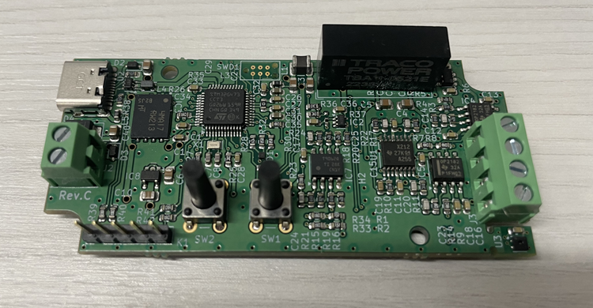

---

# Overview

This Potentiostat Firmware provides:
- Voltage Control
- Current Measurement
- Wavefront Generation (CV, CA, CP, etc.)
- Digital filtering 
- Parameter configuration via Modbus

---

# Main Functionalities

GO MORE IN DETAILS HERE

---

# How to use

In the [**Releases**](https://github.com/aurelienblanc2/Potentiostat-firmware/releases) section of this repository, you’ll find a ready-to-flash .elf file for the Potentiostat, along with 
a frozen snapshot of the corresponding source code.

The simplest way to get started is to download the .elf file and follow the flashing instructions provided below.

If you’d like to modify the source code, you can clone this repository directly. A section further down explains how
to set up a proper build environment on your machine.

---

# Flashing

**Prerequisites:**

Download [**STM32CubeProgrammer**](https://www.st.com/en/development-tools/stm32cubeprog.html)

## Easiest Way

**Steps:**
1. Launch **STM32CUbeProgrammer**


2. In the right panel, select the USB tab

3. To enter **bootloader** mode, press and hold the button closest to the USB-C connector, then plug the Potentiostat
to your computer via USB/USB-C

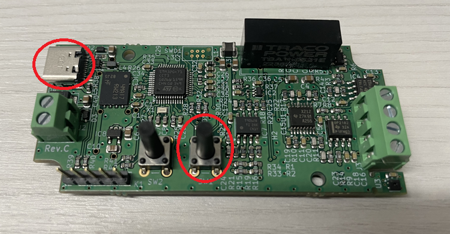
4. **Refresh** the Port list until a connection appears, then click **Connect** (if no Port is detected, repeat step 3.)

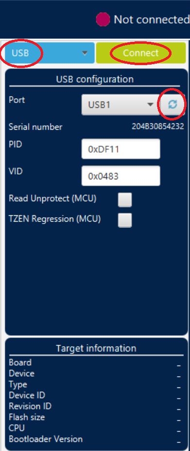

5. Verify that the Potentiostat is connected and recognized

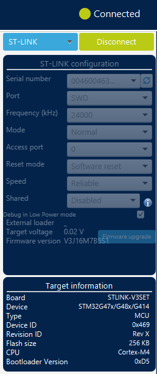

6. Go to Erasing & Programming on the left panel


7. Select the .elf to flash

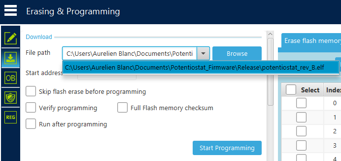

8. Hit Start Programming

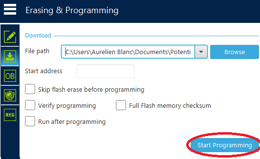

9. Verify the downloading succeeded

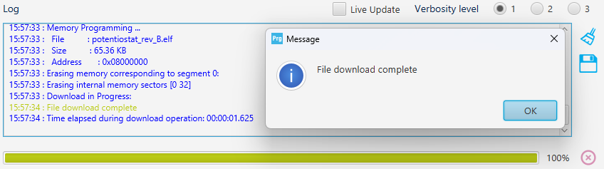

10. Disconnect from STM32CubeProgrammer

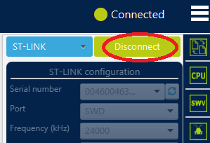

11. Close STM32CubeProgrammer
12. Unplug and plug again the Potentiostat
13. The Potentiostat is now ready to be used via the USB-C port (check your computer to see if the COM Port is 
well recognized)

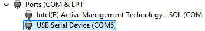

## Other Way

**More Prerequisites:**
1. Have a [**ST-Link V3 SET**](https://www.st.com/en/development-tools/stlink-v3set.html)  
2. Have a [**Tag-Connect cable**](https://www.tag-connect.com/debugger-cable-selection-installation-instructions/stlink-v3set#130_126_180)
(6 pin in our case) for the ST-Link V3 SET

**Steps:**
1. Connect the Potentiostat to your computer by USB-C for the power supply
2. Plug the Tag-connect adapter to the STDC14 port of yout ST-Link V3 SET

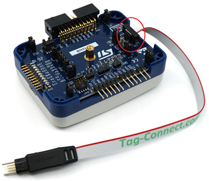

3. Connect the Tag-connect to your potentiostat  

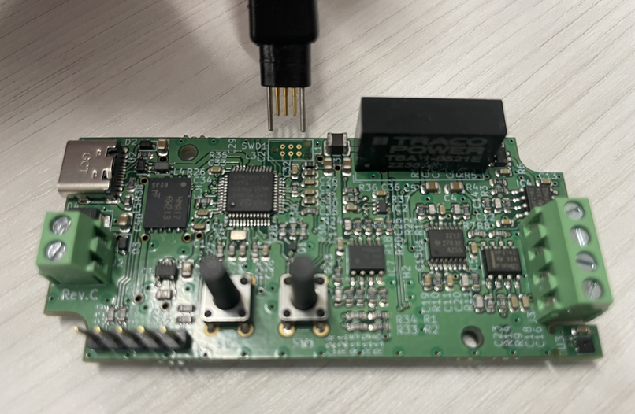
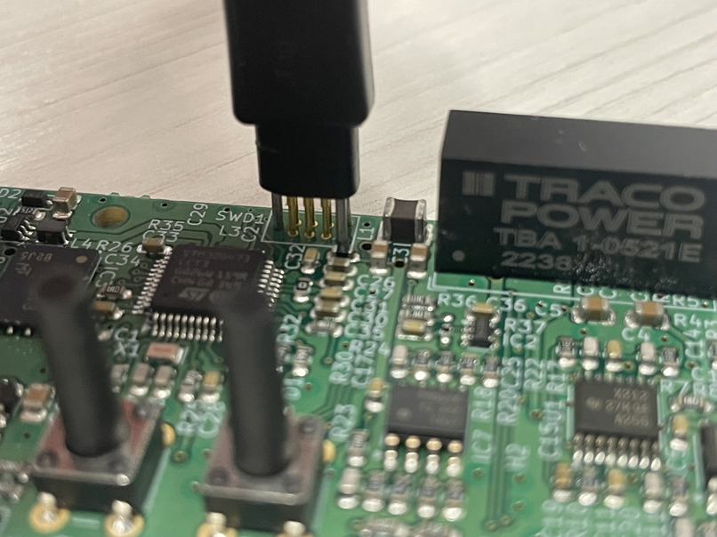

4. Connect the ST-Link V3 SET to your computer by USB
5. Launch STM32CubeProgrammer
6. Select ST-LINK with SWD Port and then hit Connect 


7. Follow the steps 5 to 11 of the **Easiest Way**
8. Remove the Tag-Connect
9. Unplug the ST-Link V3 SET from your computer 
10. Unplug and plug again the Potentiostat
11. The Potentiostat is now ready to be used via the USB-C port (check your computer to see if the COM Port is 
well recognized)


---

# Build Environment

You can compile the project directly using the terminal of your operating system (described below), or use 
[STM32CubeIDE](https://www.st.com/en/development-tools/stm32cubeide.html) which provides a complete development 
environment compatible with the Potentiostat microcontroller.

# Prerequisites:

Having gcc, make and gcc-arm-none-eabi (toolchain based on GCC designed for ARM microcontrollers) installed  

1. For Linux:
```bash
sudo apt update
sudo apt install build-essential gcc-arm-none-eabi
```

2. For Windows:  
Install Chocolatey, follow the instructions on [chocolatey](https://chocolatey.org/install)  
Then in your administrator PowerShell
```bash
choco install mingw gcc-arm-embedded
```

3. For macOS:  
Install Homebrew, follow the instructions on [brew](https://brew.sh/) to install it.
```bash
brew install gcc make arm-none-eabi-gcc
```

# Building:

Clone this repository and run make for Linux or macOS, mingw32-make for Windows

```bash
git clone https://github.com/aurelienblanc2/Potentiostat-firmware
cd Potentiostat-firmware
make
```

---

# File Structure

```
Potentiostat-firmware/
├── README.md                    # This file
├── Docs/                        # Folder for the ressources used by the README.md
├── LICENSE                      # MIT Licence
├── Makefile                     # Makefile of the project
└── src/
    ├── Core
    │   ├── Inc
    │   ├── Src
    │   ├── Startup
    │   └── ThreadSafe
    ├── Drivers
    │   ├── CMSIS
    │   └── STM32G4xx_HAL_Driver
    ├── FATFS
    │   ├── App
    │   └── Target
    ├── Middlewares
    │   ├── ST
    │   └── Third_Party
    ├── USB_Device
    │   ├── App
    │   └── Target
    └──STM32G473CCTX_FLASH.ld     # Linker file
```

---

# Bugs & Support

If you encounter a bug, have a feature request, or need help:
- contact: aurelien.blanc@utoronto.ca
- Or contact: adpisa@gmail.com

---

# Contributing

Contributions are very welcome!  
If you’d like to add features, fix bugs, or improve documentation, please submit a merge request or open an issue to discuss your ideas.

---

# License

MIT License

# Author

Adrián Pinilla-Sánchez - adpisa@gmail.com  
Aurelien Blanc - aurelien.blanc@utoronto.ca

---